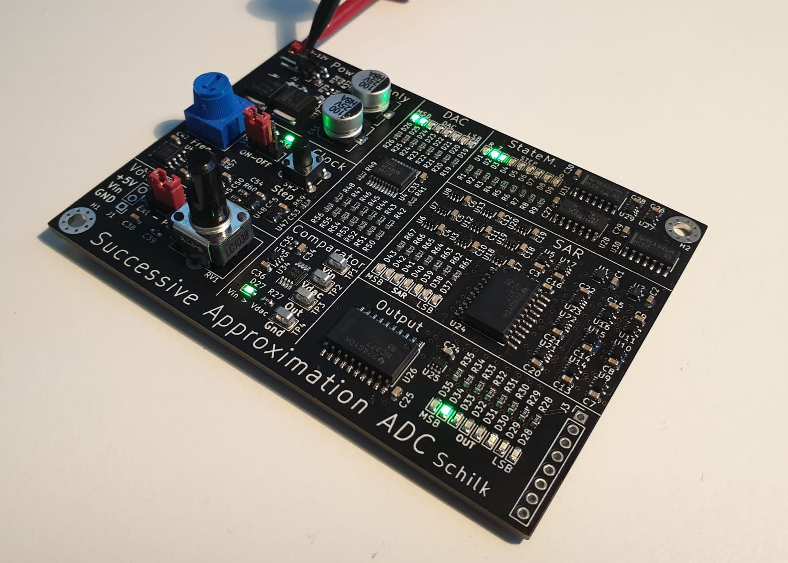
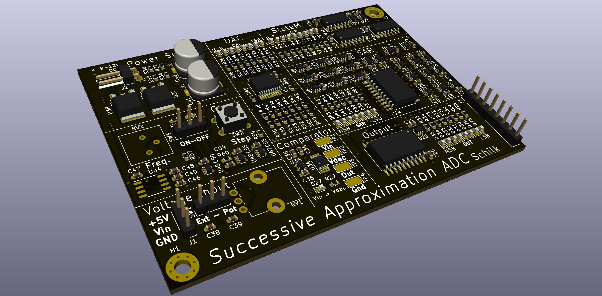
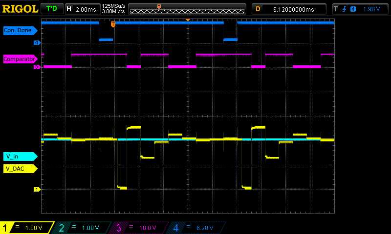
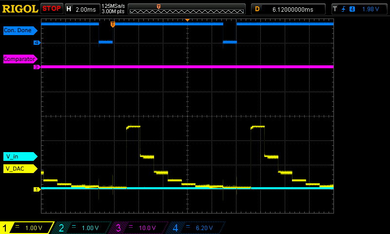

# SA-ADC
### Philipp Schilk
A discrete successive-approximation ADC controlled by a 74-series logic gate state machine.

Built to understand SA-ADCs, and serve as a demonstration unit.

## Status
Finished. 

## Specifications
| Specification  | Value  |
| :------------ | ------------: |
| Resolution  | 8-bit  |
| Sample Rate  |  1Hz - 90Hz |
| Input Voltage Range | 0-5V |
| Input | Single-ended|
| Input Source | Included Potentiometer or External Input |
| Supply Voltage | 9-12Vdc |
| Output | 8-bit parallel |

As this is a demonstration unit only really meant for DC inputs, no Sample-&-Hold
stage is included.

## Successive Approximation Architecture

This Project uses the classic DAC-based Successive Approximation Architecture [Wikipedia](https://en.wikipedia.org/wiki/Successive_approximation_ADC "DAC-based Successive Approxmation Architecture").

It is essentially an analog implementation of a binary-search algorithm. The ADC first sets 
it's DAC to 2.5V (Vref/2), and uses an analog comparator to determine if the applied input voltage is 
higher or lower than the generated voltage. Depending on the comparator's output the DAC voltage is 
then repeatedly refined to determine each bit of the conversion-result successively.

Here are two example conversions, with Vin = 2V and Vin = 0V:

The steps of the conversion are show in the State-Machine outputs/LEDs:

|  LED  | Description |
| ------------ | ------------ |
| R | SAR (Successive Approximation Register) bits 6-1 are reset |
| 7 | Bit 7 is tested and latched if set. |
| 6 | Bit 6 is tested and latched if set. |
| ... | ... |
| 0 | Bit 0 is tested. Bit 7-1 are latched into the output from the SAR , and bit 0 is latched from the comparator |

*A note on clocks/timing:*
The state machine/shift-register is clocked on the falling edge, while the SAR (Successive Approximation Register) and the output register are 
latched on the rising edge. Due to this, all signals (including the DAC and hence the
comparator output) are setup on the falling edge of the clock by the state machine, and have until the 
rising edge of the clock to stabilize and be latched into the different registers.

## Repo Overview

See [Github Releases]() for Gerbers, Interactive BOM, etc.

**Doc/**  
	Documentation  

**KiCad/**  
	KiCad Project Files (Schematic and PCB).  

**Logisim/**  
	Visual Logic Simulation.  
	Download LogiSim at [cburch.com](http://www.cburch.com/logisim/).  

